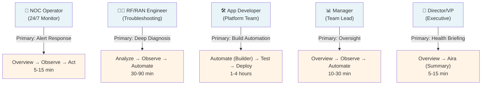
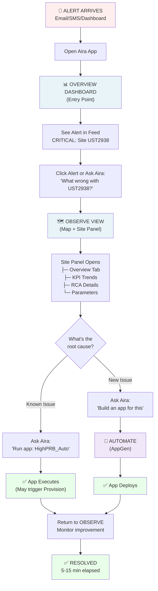
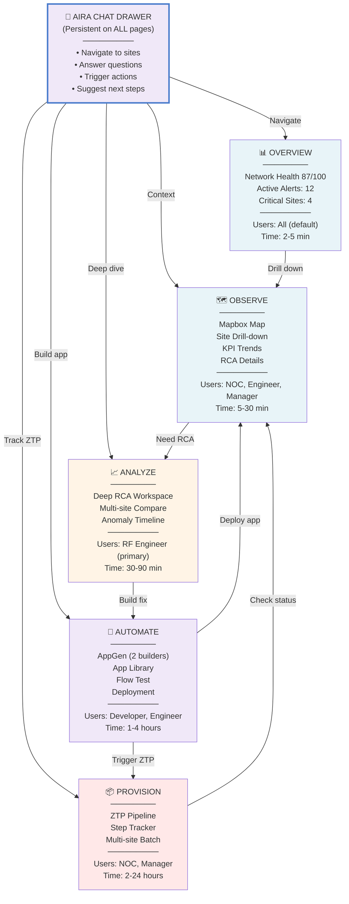
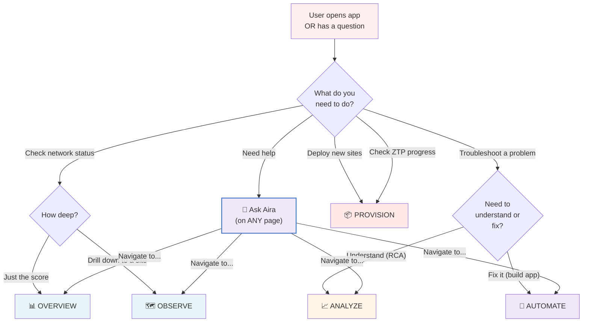

# Visual Block Diagrams - Aira Platform User Flows

> Copy these Mermaid diagrams into Figma (Mermaid plugin) or into a markdown viewer (GitHub, Notion, etc.)

---

## 1. The 5 User Personas & Their Primary Workflows

---

## 2. Alert Response Flow (NOC Operator)

---

## 3. Apps & How They Connect

---

## 4. Decision Tree: What App Should User Go To?

---

## Color Legend (Used in Diagrams)

- 🔴 **Red (`#fee`)** = Entry point / Start
- 🔵 **Blue (`#e8f4f8`)** = Observation views (what users see)
- 🟡 **Yellow (`#fff4e6`)** = Analysis & deep work
- 🟣 **Purple (`#f0e8f8`)** = Aira / AI features
- 🟢 **Green (`#e8fee8`)** = Resolution / Success
- 🟠 **Orange (`#ffe8e8`)** = Provisioning / Infrastructure
